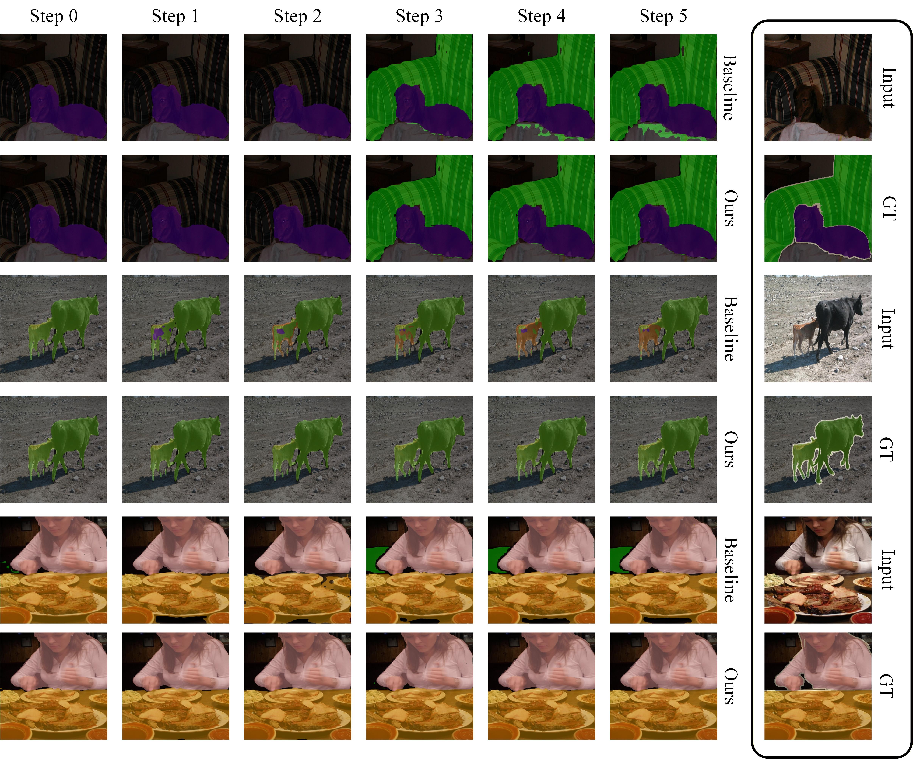

# Prototype-aware Few-shot Incremental Semantic Segmentation

## Abstract


Few-shot incremental semantic segmentation aims to continuously expand the category space of semantic segmentation models using only a few annotated samples of new classes, while maintaining stable recognition of previously learned classes. This task is constrained by data scarcity, catastrophic forgetting, semantic drift, and background shift. Conventional fixed distillation, single-stage prototype matching, or prediction-level background modeling methods struggle to balance old-class retention, new-class adaptation, and foreground-background discrimination. To address these challenges, this paper proposes a Prototype-aware Few-shot Incremental Semantic Segmentation method (PAFS). First, a few-shot-aware adaptive distillation module is constructed to dynamically adjust the distillation strength according to the stability of class prototypes, thereby reducing the interference of unreliable teacher responses on new-class learning. Second, a prototype-space-guided channel semantic alignment module is designed to map old and new classes into a unified prototype space and semantically modulate channel responses, alleviating cross-stage feature drift. Finally, a semantic-anchor contrastive background compensation mechanism is introduced, which uses old-class prototypes as stable semantic anchors to correct the decision boundary between background and foreground. Experiments under single-step and multi-step few-shot incremental settings on PASCAL VOC and COCO show that PAFS achieves the best or second-best harmonic mean performance in most scenarios.


## How to run
### Requirements
We have simple requirements:
The main requirements are:
```
python > 3.1
pytorch > 1.6
```
If you want to install a custom environment for this codce, you can run the following using [conda](https://docs.conda.io/projects/conda/en/latest/commands/install.html):
```
conda install pytorch torchvision cudatoolkit=10.1 -c pytorch
conda install tensorboard
conda install jupyter
conda install matplotlib
conda install tqdm
conda install imageio

pip install inplace-abn
conda install -c conda-forge pickle5
```

### Datasets 
In the benchmark there are two datasets: Pascal-VOC 2012 and COCO (object only).
For the COCO dataset, we followed the COCO-stuff splits and annotations, that you can see [here](https://github.com/nightrome/cocostuff/).

To download dataset, follow the scripts: `data/download_voc.sh`, `data/download_coco.sh` 

To use the annotations of COCO-Stuff in our setting, you should preprocess it by running the provided script. \
Please, remember to change the path in the script before launching it!
`python data/coco/make_annotation.py`

Finally, if your datasets are in a different folder, make a soft-link from the target dataset to the data folder.
We expect the following tree:
```
/data/voc/dataset
    /annotations
        <Image-ID>.png
    /images
        <Image-ID>.png
        
/data/coco/dataset
    /annotations
        /train2017
            <Image-ID>.png
        /val2017
            <Image-ID>.png
    /images
        /train2017
            <Image-ID>.png
        /val2017
            <Image-ID>.png
```


### Run!
We provide different scripts to run the experiments (see `run` folder).
In the following, we describe the basic structure of them.


```
sh coco-ms.sh
```
```
sh coco-ss.sh
```
```
sh voc-ms.sh
```
```
sh voc-ss.sh
```


## Qualitative Results



